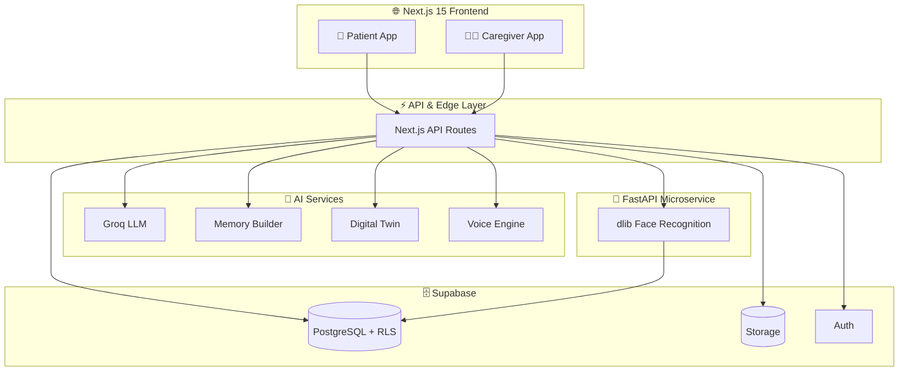

<div align="center">

# 🧠 Memory Companion

### *Where memory loss meets technology, dignity, and love.*

**An AI-powered care platform that keeps people living with dementia & Alzheimer's oriented, connected, safe, and independent — while giving caregivers a calmer, smarter, and more compassionate way to care.**

<br/>


<br/>

> ### 💙 *"It is an attempt to make memory loss a little less lonely."*

[**Live Demo**](#) · [**Report Bug**](#) · [**Request Feature**](#) · [**Documentation**](#)

</div>

---

## 📖 Table of Contents

- [The Problem](#-the-problem)
- [Why Memory Companion Exists](#-why-memory-companion-exists)
- [Product Showcase](#-product-showcase)
- [Platform Overview](#-platform-at-a-glance)
- [Caregiver Features](#️-caregiver-features)
- [Patient Features](#-patient-features)
- [AI Innovation Layer](#-ai-innovation-layer)
- [Face Recognition System](#️-face-recognition-system)
- [Voice & Conversation Engine](#️-voice--conversation-engine)
- [Safety & Location Intelligence](#-safety--location-intelligence)
- [Tech Stack](#️-tech-stack)
- [System Architecture](#️-system-architecture)
- [Database Schema](#️-database-schema)
- [Platform Impact](#-platform-impact)
- [Getting Started](#-getting-started)
- [Environment Variables](#-environment-variables)
- [Privacy & Safety](#-privacy--safety)
- [Roadmap](#-roadmap)
- [Contributing](#-contributing)
- [Creator](#-creator)

---

## 🌍 The Problem

> Over **55 million people** worldwide live with dementia, and a new case is diagnosed roughly **every 3 seconds**. Behind each diagnosis is a family quietly carrying the weight of confusion, fear of wandering, missed medication, repeated questions, and the slow ache of a loved one forgetting names and faces.

Care today is fragmented across sticky notes, group chats, pill organizers, and worry. **Memory Companion replaces that chaos with one calm, intelligent system** — built for both the person living with dementia *and* the people who love them.

---

## ✨ Why Memory Companion Exists

Memory Companion unifies AI, safety systems, family memories, cognitive activities, and caregiver tools into a single platform designed to make daily life **safer, calmer, and more connected.**

### Core Goals

| 🧠 | **Support memory recall** through familiar faces, voices, and moments |
|----|---------------------------------------------------------------------|
| 👨‍👩‍👧 | **Strengthen family connections** even as memory fades |
| 📍 | **Improve patient safety** with location and SOS intelligence |
| 😊 | **Encourage emotional wellbeing** through gentle daily check-ins |
| 🤖 | **Provide AI-powered assistance** that is grounded and trustworthy |
| 📊 | **Deliver actionable caregiver insights** instead of raw data |

---

## 📸 Product Showcase

### 🌸 Patient Experience

| Patient Home | Feel Good & Activities | Live Face Recognition |
|
|
|
|  |  |  |
| *Calm home with Today's Plan* | *Mood, gratitude, games & companion* | *"Who is this?" camera recall* |

### 👩‍⚕️ Caregiver Experience

| Digital Twin | Monitoring & Trends | Patient Management |
|:---:|:---:|:---:|
|  |  |  |
| *Live state + 7-day trends* | *Adherence, mood, activity* | *Profiles, medical info, contacts* |

---

## 🌟 Platform at a Glance

<div align="center">

| 🌸 **Patient Experience** | 👩‍⚕️ **Caregiver Experience** |
|:--------------------------|:------------------------------|
| Daily guidance & gentle reminders | Real-time monitoring dashboard |
| Family & face recognition | AI-generated daily summaries |
| One-tap SOS support | Smart alerts & notifications |
| Cognitive games & memory activities | Patient & profile management |
| Mood & gratitude check-ins | Analytics, trends & reports |
| Voice-enabled AI companion | Digital Twin predictive insights |

</div>

---

## 👩‍⚕️ Caregiver Features

### 📋 Care Management
- **Patient Profile Management** — central record for each person in your care
- **Family Members Directory** — relationships, photos, and bios
- **Medical Information Storage** — conditions, allergies, blood type, physicians
- **Emergency Card Generation** — instant, shareable, tokenized care card
- **Emergency Contact Management** — prioritized contact chains

### 🗓️ Daily Care Tools
- **Smart Routines** — adaptive daily schedules that learn patterns
- **Medication Reminders** — dose tracking with confirmation
- **Appointment Tracking** — never miss a doctor's visit
- **Reminiscence Library** — curated photos, stories, and music
- **Personalized Memory Content** — auto-built from caregiver notes

### 📊 Monitoring & Insights
- **Monitoring** — live overview of the patient's current state
- **Mood History** — emotional trend visualization
- **Cognitive Tracking** — performance over time across activities
- **Weekly Reports** — readable, AI-written care summaries
- **Notifications Center** — unified, prioritized alerts
- **Digital Twin Analytics** — live state + 7-day trends (adherence, mood, game sessions, app activity)

### 🤖 AI Tools (Caregiver)
- **Memory Builder** — turn notes into structured patient knowledge
- **Daily Summary** — one-tap AI report of the patient's day
- **Suggest Prompts** — AI-recommended conversation starters & activities

### 🛡️ Safety Systems
- **Face Enroll** — register trusted family members for recognition
- **Location Safety** — live GPS with history
- **Geofence Alerts** — instant notification if a safe zone is left
- **SOS Event Tracking** — logged emergencies with context

### ✨ New Caregiver Tools
- **🤝 Multi-Caregiver Collaboration** — invite family & professional carers with a secure **Invite code** and role-based permissions (admin / contributor / view-only)
- **🩺 Care Team Notes** — shared, timestamped observation log across all caregivers
- **📅 Shift Handover Mode** — auto-generated summary of "what happened on my shift" for the next caregiver
- **🔔 Smart Escalation** — if a primary caregiver doesn't respond to an SOS within *N* minutes, the alert cascades to backup contacts
- **🧾 Insurance & Document Vault** — securely store and retrieve medical/legal documents
- **🗣️ Caregiver Wellbeing Check** — burnout self-assessment + curated respite resources (because carers need care too)

---

## 🌸 Patient Features

> Designed around the patient's own words: *"You are safe and you are cared for."* Every screen is large-text, low-stress, and one tap away from help. A floating **HELP** button and **Location on** indicator stay visible at all times.

### 🌅 Everyday Support
- **Home** — a warm, personalized greeting (*"Good afternoon, Surmi"*) with the day and date front and center
- **Today's Plan** — a simple, large-text view of the day's schedule

### 🤝 Connect
- **My Family** — see your loved ones, their faces, names, and relationships
- **Call for Help** — your trusted contacts, one tap away
- **Who is this?** — point your camera to instantly identify someone in front of you (live face recognition)

### 💗 Feel Good
- **Remember When** — photos & stories from your life (reminiscence)
- **How I Feel** — share your mood with a single tap
- **Gratitude Jar** — record one good thing today
- **Take a Breath** — a calm, guided breathing moment

### 🧩 Activities
- **My Game** — *"Who is this?"* — a personalized family recognition game
- **Guess the Memory** — *"Do you remember?"* — photo-based recall challenges
- **Soothing Sounds** — calming music & audio to settle the mind
- **Talk to Me** — *"Ask me anything"* — the voice-enabled AI companion

### ✨ New Patient Experiences *(roadmap-ready)*
- **⏰ Orientation Anchor** — always-visible card showing *who you are, where you are, the day, date, and weather* (reduces disorientation distress)
- **🎵 Music Memory Therapy** — familiar songs from youth that spark recall and lift mood
- **📖 "My Story" Mode** — an AI-narrated life storybook built from family memories, read aloud in a familiar voice
- **🌙 Sundowning Support** — evening-aware UI that softens and reassures during the hardest hours
- **🍽️ Meal & Hydration Prompts** — gentle nudges to eat and drink, with caregiver confirmation
- **📞 One-Tap Video Call** — call a loved one by tapping their face, no dialing required

---

## 🤖 AI Innovation Layer

### 🧱 Memory Builder
Transforms unstructured caregiver notes into structured, usable knowledge:
- Family relationships
- Important memories
- Favorite music
- Routine suggestions
- Patient profile updates

### 💬 Companion AI
A safe, grounded conversational partner:
- **Retrieval-Grounded Generation (RAG)** — answers only from approved facts
- **Hallucination Prevention** — never invents people or memories
- **Voice Interaction** — natural, hands-free conversation
- **Family-Aware Responses** — knows who's who
- **Safe Conversation Design** — calm, redirecting, never argumentative

### 📝 Daily Summary Generator
Turns a day of data into a human-readable report covering reminder completion, mood changes, activity participation, and safety events.

### 🔮 Digital Twin
A continuously-updating model of the patient that analyzes wellness trends, mood history, cognitive activity, routine adherence, and notification patterns.

### ✨ New AI Capabilities
- **📈 Cognitive Decline Early-Warning** — detects subtle drops in game performance, response time, and routine adherence, surfacing *gentle* "worth mentioning to the doctor" flags
- **🧠 Adaptive Difficulty Engine** — games and prompts auto-tune to the patient's current cognitive level so they're never frustrating or patronizing
- **🌐 Multilingual Companion** — converses in the patient's first language, critical since dementia often causes regression to a mother tongue
- **🎭 Emotion-Aware Responses** — detects distress in voice/text and shifts tone, pace, and content accordingly
- **📋 Doctor Visit Prep** — auto-compiles a structured summary of changes since the last appointment
- **🔁 Repetition-Aware Memory** — recognizes when a patient asks the same thing repeatedly and answers with infinite, identical patience

---

## 👁️ Face Recognition System

```
   Caregiver Upload
          ↓
    Face Detection
          ↓
  Embedding Generation
          ↓
    Secure Storage  ── (image discarded)
          ↓
  Patient Recognition
          ↓
   Relationship Recall
```

### 🔐 Security
- **Family-scoped matching** — embeddings never cross family boundaries
- **No image persistence** — photos are processed, then destroyed
- **Embedding-only storage** — only mathematical vectors are kept
- **Service authentication** — recognition service is secret-protected

---

## 🗣️ Voice & Conversation Engine

> *Already implemented and shipping.* Memory Companion speaks and listens.

- **Voice-First Companion** — full hands-free conversation for patients who struggle with screens
- **Personalized Voice Cloning** — the companion can speak in a familiar, trusted family voice
- **Natural Speech Synthesis** — warm, slow, clear text-to-speech tuned for older ears
- **Speech-to-Text Check-ins** — patients can talk through mood and gratitude entries
- **Wake-Word Activation** — no buttons needed to start a conversation

---

## 🛰️ Safety & Location Intelligence

- **Live GPS Tracking** with location history
- **Customizable Geofences** — define multiple safe zones (home, garden, day-center)
- **Wander Detection** — alerts when movement patterns indicate disorientation
- **SOS Event Log** — every emergency captured with time, location, and context
- **Smart Escalation Chains** — alerts cascade until someone responds
- **🔋 Device Health Monitoring** *(new)* — caregiver is warned if the patient's device battery is low or signal is lost

---

## 🛠️ Tech Stack

<div align="center">

| Layer | Technology |
|:------|:-----------|
| 🖥️ Frontend | **Next.js 15** (App Router) |
| 🔤 Language | **TypeScript** |
| 🎨 Styling | **Tailwind CSS** |
| 🗄️ Database | **Supabase (PostgreSQL)** |
| 🔐 Authentication | **Supabase Auth** |
| 📦 Storage | **Supabase Storage** |
| 🧠 AI / LLM | **Groq** |
| 🌀 State Management | **Zustand** |
| 🎬 Animations | **Framer Motion** |
| 👁️ Face Recognition | **dlib** |
| ⚙️ Backend Service | **FastAPI** |
| 🗣️ Voice | **TTS / Voice Cloning Pipeline** |

</div>

---

## 🏗️ System Architecture



---

## 🗄️ Database Schema

All tables are protected by **Row-Level Security** and scoped by `family_id`.

```
families              → top-level tenant boundary
profiles              → caregiver accounts
patients              → people receiving care
people                → family members & contacts
routines              → daily schedules
reminders             → medication / task reminders
reminiscence_items    → photos, stories, music
mood_checkins         → emotional logs
notifications         → alerts & messages
cognitive_reports     → game & activity results
face_enrollments      → face embeddings (no images)
patient_medical_info  → conditions, allergies, meds
events_log            → SOS, geofence & system events
care_team_notes       → shared caregiver observations  ✨ new
documents_vault       → secured medical/legal files     ✨ new
```

---

## 📈 Platform Impact

<div align="center">

| 📊 Category | 🔢 Count |
|:------------|:---------|
| AI Systems | **6+** |
| Interfaces | **2** (Patient + Caregiver) |
| Protected Tables | **14+** |
| Safety Features | **7+** |
| Cognitive Activities | **Multiple** |
| Languages Supported | **Multilingual** |
| Lives It's Built For | **55M+** |

</div>

---

## 🚀 Getting Started

### Prerequisites
- Node.js **18+**
- A **Supabase** project
- A **Groq** API key
- Python **3.10+** (for the face recognition service)

### Quick Start

```bash
# 1. Clone the repository
git clone https://github.com/your-username/memory-companion.git
cd memory-companion

# 2. Install dependencies
npm install

# 3. Configure environment variables (see below)
cp .env.example .env.local

# 4. Run the development server
npm run dev
```

### Run the Face Recognition Service

```bash
cd services/face
pip install -r requirements.txt
uvicorn main:app --reload --port 8000
```

Visit **http://localhost:3000** 🎉

---

## 🔐 Environment Variables

```env
# Supabase
NEXT_PUBLIC_SUPABASE_URL=
NEXT_PUBLIC_SUPABASE_ANON_KEY=
SUPABASE_SERVICE_ROLE_KEY=

# AI
GROQ_API_KEY=

# Face Recognition Service
FACE_SERVICE_URL=
FACE_SERVICE_SECRET=

# Voice (optional)
VOICE_API_KEY=
```

---

## 🔒 Privacy & Safety

> Memory Companion handles some of the most sensitive data imaginable — and treats it that way.

### 🛡️ Data Isolation
Every table is protected through **Row-Level Security** and scoped by family. No data ever crosses family boundaries.

### 🤖 AI Safety
The companion AI **only responds using caregiver-approved information.** It cannot invent people, memories, or facts.

### 👁️ Face Recognition
**Only mathematical embeddings are stored.** Original images are processed and immediately discarded.

### 🚨 Emergency Systems
Emergency cards use **secure, tokenized, revocable** sharing links — shareable in a crisis, killable in a click.

### ✅ Trust by Design
- Audit logging on sensitive actions
- Role-based access for multi-caregiver families
- No third-party ad tracking, ever

---

## 🚀 Roadmap

### ✅ Phase 1 — *Shipped*
- AI Companion
- Face Recognition
- GPS Tracking
- Memory Builder
- Caregiver Dashboard
- **Voice Cloning & Voice Companion**

### 🚧 Phase 2 — *In Progress*
- Cognitive Decline Prediction
- Wearable Integration (heart rate, sleep, falls)
- Smart Medication Support (dispenser sync)
- Multi-Caregiver Collaboration
- Music Memory Therapy

### 🔮 Phase 3 — *Future Vision*
- AR Family Recognition (point your camera, see who's who)
- Smart Home Integration (lights, locks, stoves)
- Personalized Cognitive Therapy programs
- Predictive fall & health-event detection
- Clinician portal & EHR integration

---

## 🤝 Contributing

Contributions make the open-source community an amazing place to learn and build. Any contributions you make are **deeply appreciated.**

```bash
# 1. Fork the project
# 2. Create your feature branch
git checkout -b feature/amazing-feature
# 3. Commit your changes
git commit -m "Add some amazing feature"
# 4. Push to the branch
git push origin feature/amazing-feature
# 5. Open a Pull Request
```

Please read the contributing guidelines and code of conduct before submitting. Bug reports and feature requests are welcome in the [Issues](#) tab.

---

## 👩‍💻 Creator

<div align="center">

### **Anshika Jain**
*Int. MTech, Computer Science Engineering — VIT Bhopal University*

[](https://anshika-portfolio-seven.vercel.app/)
[](https://github.com/Annshikaa)
[](https://linkedin.com/in/anshika-jain-44672a250)

</div>

---

## 📄 License

Distributed under the **MIT License**. See `LICENSE` for more information.

---

<div align="center">

## 💙 Built for Families. Powered by AI.

**Memory Companion is more than software.**
*It is an attempt to make memory loss a little less lonely.*

<br/>

⭐ **If this project moved you, star the repository — it helps more families find it.**

<br/>

*Made with 💙 for the 55 million people, and the families who love them.*

</div>
